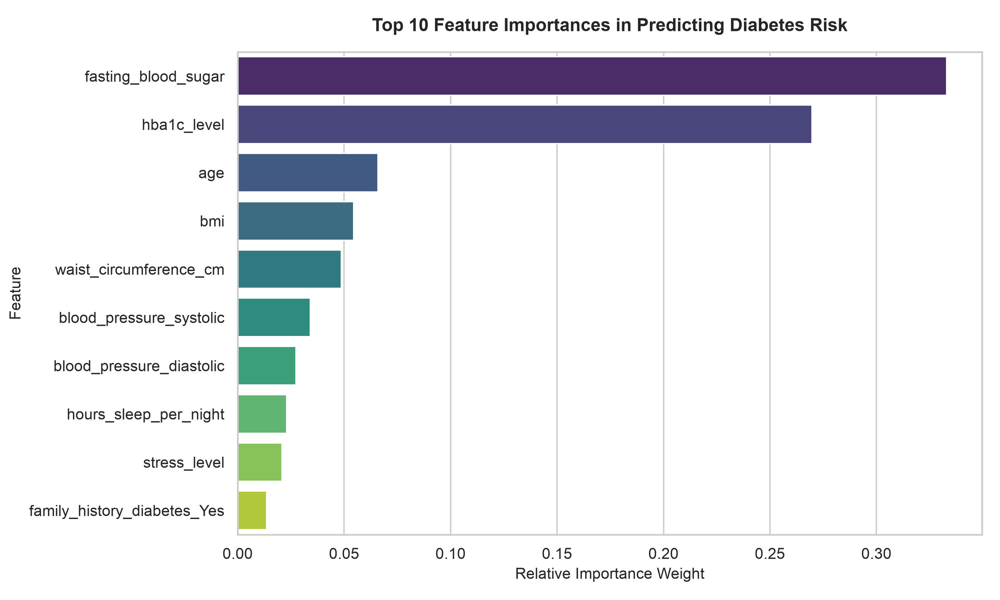
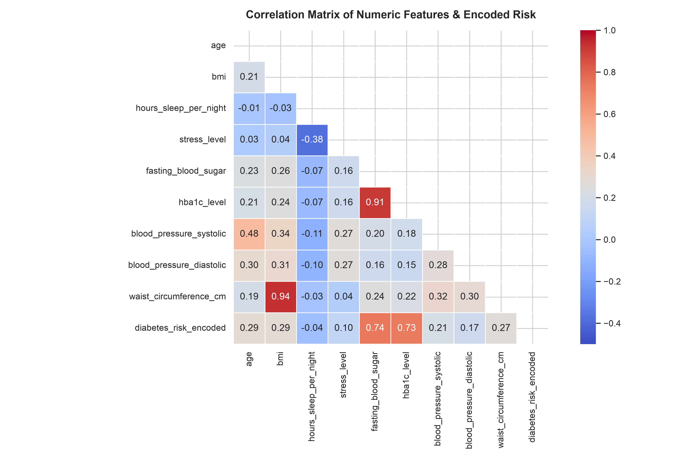

# Diabetes Risk Stratification & Predictive Analytics

An end-to-end data analytics project exploring demographic, clinical, and lifestyle determinants of diabetes risk across 15,000 patients, featuring statistical hypothesis testing and Random Forest classification.

---

## Project Overview
Diabetes mellitus is one of the fastest-growing global health challenges. Early identification of individuals at risk allows healthcare systems and insurance providers to design targeted lifestyle interventions.

This project investigates:
* The relative contribution of biological markers versus lifestyle behaviors.
* The protective effect of physical activity against developing high diabetes risk.
* Machine learning predictive performance using tree-based ensembles.

---

## Key Analytical Findings
* **The Sedentary Hazard:** Sedentary patients have a **21.01%** probability of being classified as High Risk, compared to just **9.78%** for physically active patients (**2.15x relative increase**).
* **Glycemic Dominance:** Feature importance reveals that **Fasting Blood Sugar (33.3%)** and **HbA1c (27.0%)** account for over **60%** of the predictive weight in risk stratification.
* **Statistical Validation:** Chi-Square ($\chi^2 = 453.49, p < 10^{-90}$) and Kruskal-Wallis ($H > 7800, p \approx 0.0$) tests confirmed all observed disparities are statistically significant.
* **High Multicollinearity:** A very strong linear correlation was observed between BMI and waist circumference ($r = 0.94$).

---

## Key Visualizations

### Feature Importance (Random Forest)


### Correlation Matrix


---

## Tech Stack & Methods
* **Language & Environment:** Python 3, Jupyter Notebook, VS Code (macOS)
* **Data Manipulation:** `pandas`, `numpy`
* **Visualization:** `seaborn`, `matplotlib`
* **Inferential Statistics:** `scipy.stats` (Chi-Square test, Kruskal-Wallis)
* **Machine Learning:** `scikit-learn` (Random Forest Classifier, One-Hot Encoding, Stratified Train-Test Split)

---

## How to Run Locally

1. Clone this repository:
   ```bash
   git clone https://github.com/d-ddddddd/diabetes-risk-analysis.git
   cd diabetes-risk-analysis

 2.Set up a virtual environment and install dependencies:
    
    python3 -m venv .venv
    source .venv/bin/activate
    pip install -r requirements.txt

 3.Launch the analysis:
    
    jupyter notebook notebooks/01_data_exploration.ipynb
